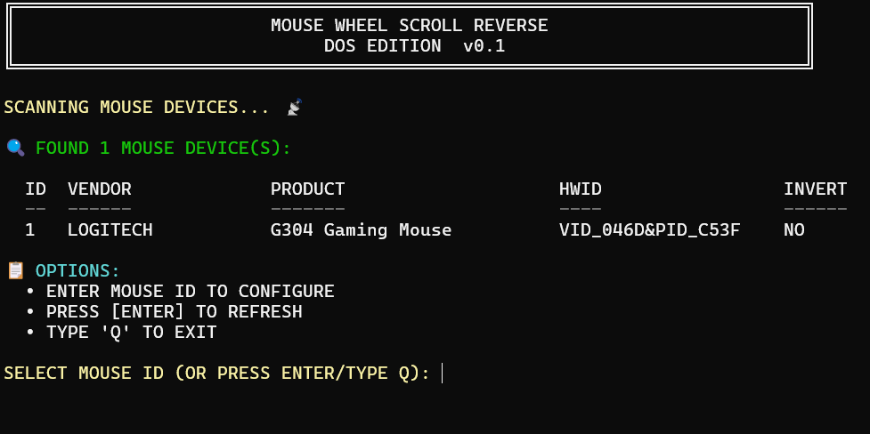

# Mouse Wheel Scroll Reverse

[ENGLISH](./README.md)

## 1. 概述

通过powershell修改注册表方式实现控制鼠标滚轮方向。可通过PS2EXE将ps1脚本转为可执行文件EXE。



## 2. 说明

### 2.1 运行

运行方式有2种。分别是通过bat或转换的exe来执行

- bat方式

  执行[run.bat](src/run.bat)直接运行。

- exe方式

  使用[build.bat](src/build.bat)批处理脚本将ps1脚本转换为可执行文件exe，然后双击打开运行。

### 2.2 鼠标数据维护

本项目使用[vendors.json](src/vendors.json)来维护各类鼠标厂商（vendorID）与产品（productID）。

可自行通过 http://www.linux-usb.org/usb.ids 或 https://devicehunt.com/ 添加数据。

## 3. 附录

### 3.1 安装 `PS2EXE`

以**管理员身份**打开 PowerShell，执行以下命令安装模块：

```powershell
# 安装 PS2EXE 模块
Install-Module -Name PS2EXE -Force
# 确认安装
Get-Module -ListAvailable PS2EXE
```

> 若提示“无法安装，因为仓库不信任”，先执行：`Set-ExecutionPolicy RemoteSigned -Scope CurrentUser`，选择 `Y` 确认。

### 3.2 打包 PowerShell 脚本为 EXE

在 PowerShell 中切换到脚本所在目录，执行打包命令：

```powershell
# 基本语法：ps2exe 源脚本路径 输出EXE路径
ps2exe .\your_script.ps1 .\output.exe
```

### 3.3 高级参数（可选）

你可以自定义 EXE 的图标、窗口样式、权限等：

```powershell
ps2exe .\your_script.ps1 .\output.exe `
-Icon .\custom.ico `          # 自定义程序图标
-WindowStyle Hidden `         # 隐藏控制台窗口（后台运行）
-AdminRequired `              # 要求以管理员身份运行
-NoConsole `                  # 完全无控制台窗口（GUI程序适用）
```

### 3.4 注意事项

- 生成的 EXE **依赖目标电脑的 .NET Framework**（一般 Windows 系统默认自带）。
- 若脚本涉及文件读写、注册表操作，EXE 运行时的权限与双击者的权限一致。
